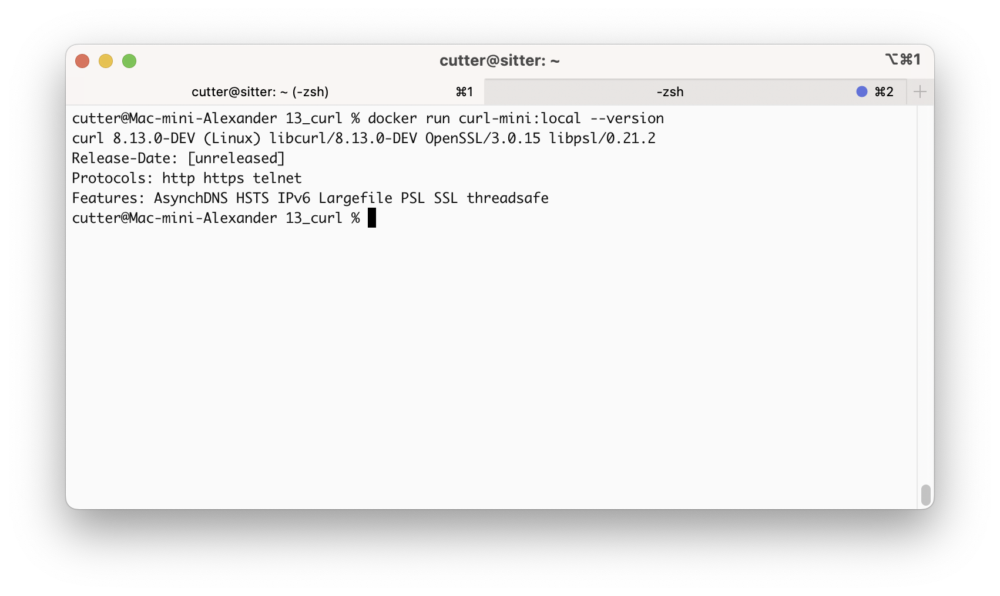

# Сборка curl с ограниченной поддержкой протоколов

## Сборка
Сборку и запуск curl предлагается сделать в Docker. Параметры cmake и
этапы компиляции и установки можно посмотреть в Dockerfile. Для сборки необходимо:

```
docker build -t curl-mini:local .
```

## Запуск
Для запуска curl:
```
% docker run curl-mini:local --version
curl 8.13.0-DEV (Linux) libcurl/8.13.0-DEV OpenSSL/3.0.15 libpsl/0.21.2
Release-Date: [unreleased]
Protocols: http https telnet
Features: AsynchDNS HSTS IPv6 Largefile PSL SSL threadsafe
```


