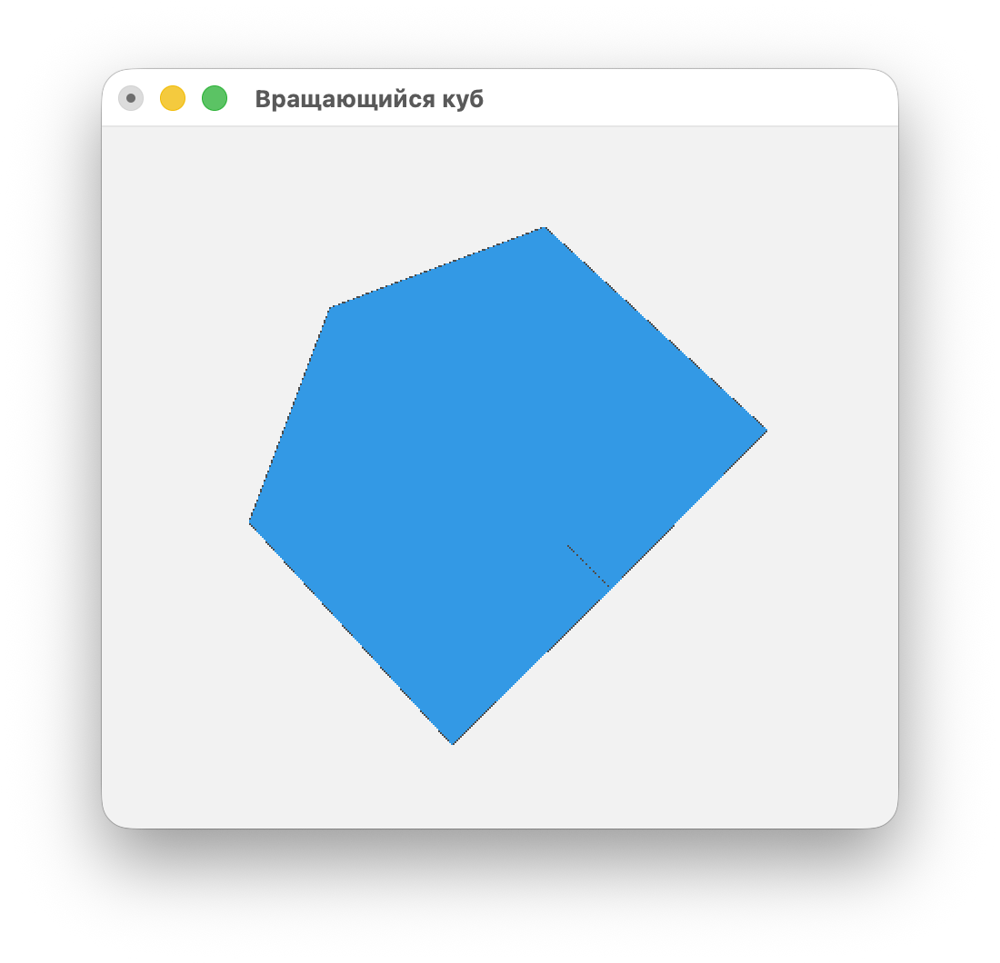

## 30_cube - OpenGL вращающийся куб

### Сборка
Установка необходимых библиотек в MacOS
```bash
brew install glfw3 glew
```
Сборка
```bash
cmake .
cmake --build .
```

### Использование
```bash
./30_cube
```
Выход из приложения происходит при нажатии клавиши Esc.


