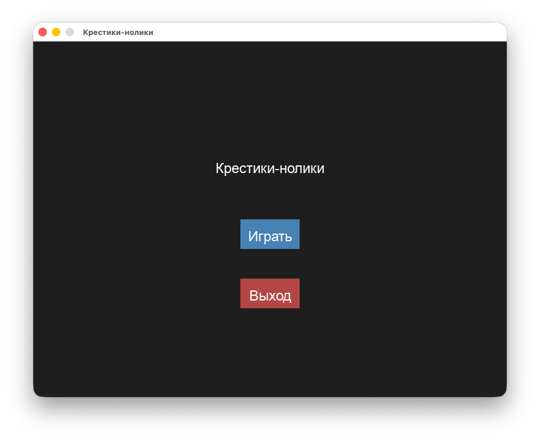
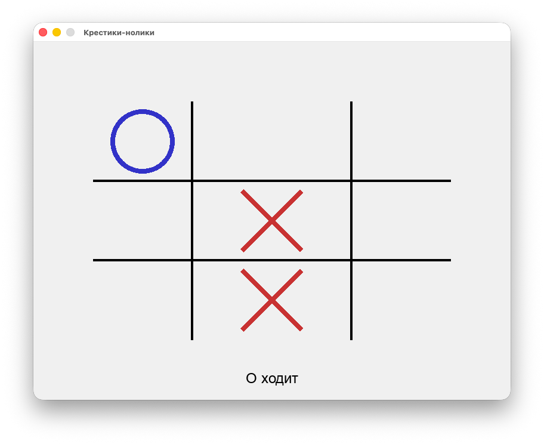
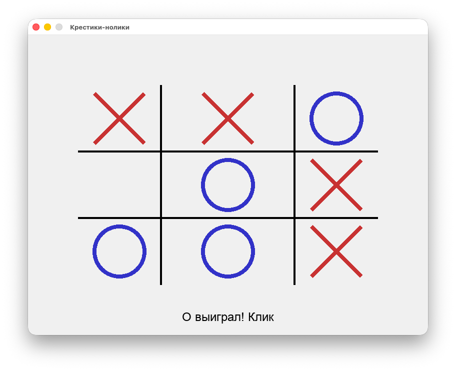

## 35_game - игра Крестики-нолики с использованием liballegro

### Сборка
Для работы игры необходима библиотека allegro. Установка в MacOS:
```bash
brew install allegro
```
Сборка:
```bash
cmake .
cmake --build .
```

### Использование

```bash
./35_game
```
Главное меню:



Ход игрока



Победа


